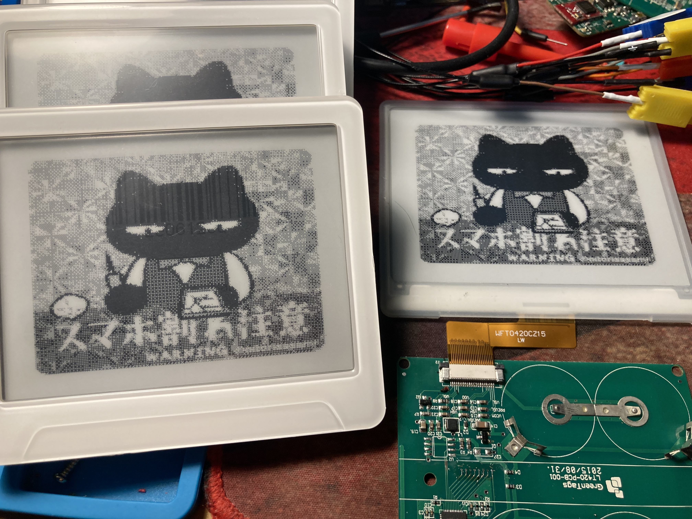
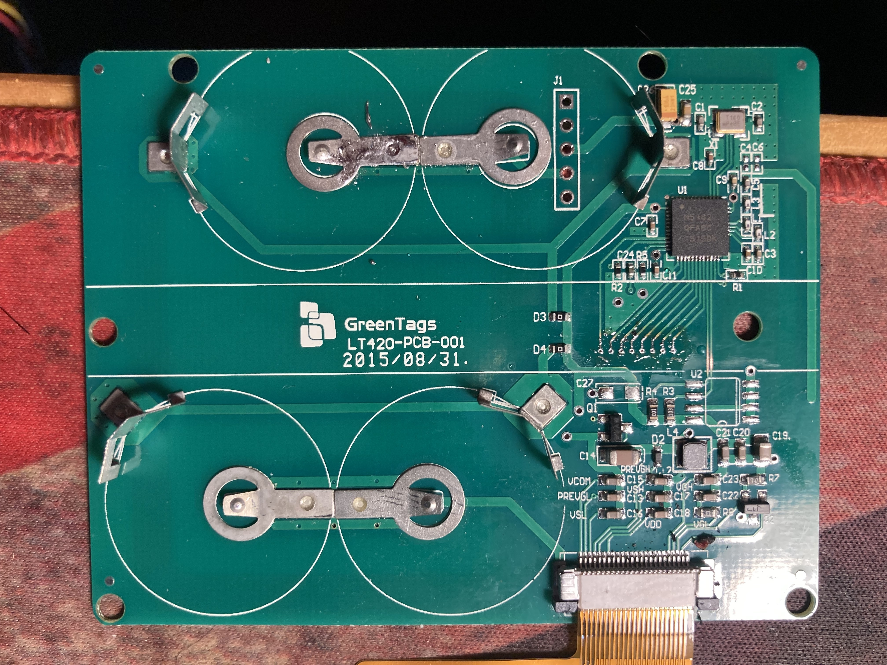

# E-Paper Display Driver for Zephyr

This repository contains the source code for driving an E-Paper display using Zephyr RTOS. The project demonstrates SPI communication, GPIO management, and LUT configuration for different E-Paper panels.

## Features

- **E-Paper Driver Initialization:** Setup and configure the E-Paper panel.
- **SPI Communication:** Sends commands and data through SPI.
- **GPIO Control:** Manages pins for data/command control and reset.
- **LUT Configuration:** Lookup table configuration for display update control.
- **Display Functions:** Supports image display, partial updates, and full screen refresh.
- **Power Management:** Implements deep sleep and wake-up functions.

## Project Structure

```
/src
  ├── main.c                # Main entry point
  ├── epd_driver.c          # E-Paper driver implementation
  ├── epd_driver.h          # E-Paper driver header file
  ├── epd_gpio.c            # GPIO initialization and control
  ├── epd_gpio.h            # GPIO header file
  ├── epd_graphics.c        # Display management functions
  ├── epd_graphics.h        # Display management header file
  ├── epd_image_data.c      # Image data 
  └── epd_config.h          # Configurations and constants
```

## Requirements

- **Zephyr SDK:** Version 2.6.2
- **Supported Boards:** nRF51822, or other boards with SPI support
- **Hardware:** E-Paper module compatible with SPI communication

## Build and Flash Instructions

1. **Clone the Repository:**

   ```bash
   git clone https://github.com/Oliver0804/nrf51822_eink42
   cd nrf51822_eink42
   ```

2. **Build the Project:**

   ```bash
   west build
   ```

3. **Flash the Firmware:**

   ```bash
   west flash -d ./nrf51822_elink42/build --skip-rebuild --dev-id <JLINKID>
   ```
 



## Configuration

- **Board Settings:** Configure your board in `prj.conf` and `CMakeLists.txt`.
- **GPIO Pins:** Adjust pin configurations in `epd_gpio.c`.
- **Display Parameters:** Update width, height, and LUT settings in `epd_config.h`.

## License

This project is licensed under the MIT License. See `LICENSE` for details.

## Author

Developed by Oliver, December 2024.

---

**Happy Coding!**
