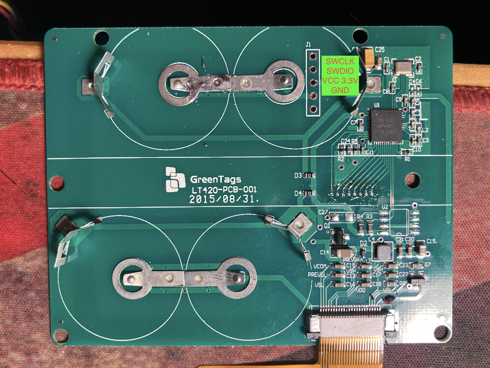
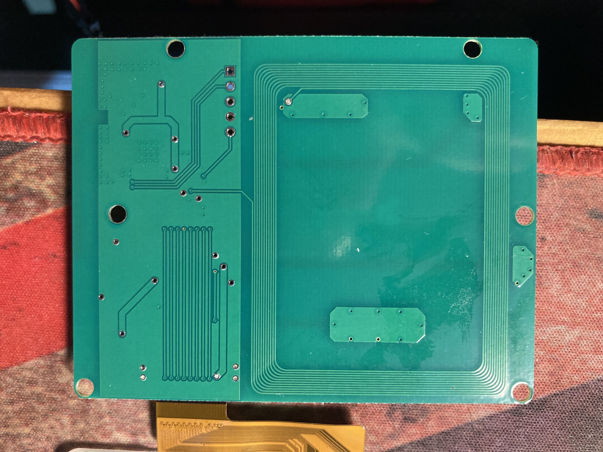

# E-Paper Display Driver for Zephyr  

  
This repository contains the source code for driving an E-Paper display using Zephyr RTOS.  
The project demonstrates SPI communication, GPIO management, and LUT configuration for different E-Paper panels.  

---

# 電子紙顯示驅動 (Zephyr)  

  

本倉庫包含用於 Zephyr RTOS 的電子紙顯示驅動源代碼，展示了 SPI 通訊、GPIO 管理以及針對不同電子紙面板的查找表 (LUT) 配置。  

---

## Features | 功能概覽  
  

- **E-Paper Driver Initialization:** Setup and configure the E-Paper panel.  
- **SPI Communication:** Sends commands and data through SPI.  
- **GPIO Control:** Manages pins for data/command control and reset.  
- **LUT Configuration:** Lookup table configuration for display update control.  
- **Display Functions:** Supports image display, partial updates, and full screen refresh.  
- **Power Management:** Implements deep sleep and wake-up functions.  

- **電子紙驅動初始化:** 設置和配置電子紙面板。  
- **SPI 通訊:** 通過 SPI 發送命令和數據。  
- **GPIO 控制:** 管理數據/命令控制和重置的引腳。  
- **LUT 配置:** 配置查找表進行顯示更新控制。  
- **顯示功能:** 支援圖片顯示、局部更新及全螢幕刷新。  
- **電源管理:** 實現深度睡眠與喚醒功能。  

---

## Project Structure | 項目結構  

```
/src
  ├── main.c                # Main entry point | 主入口
  ├── epd_driver.c          # E-Paper driver implementation | 電子紙驅動實作
  ├── epd_driver.h          # E-Paper driver header file | 電子紙驅動頭文件
  ├── epd_gpio.c            # GPIO initialization and control | GPIO 初始化與控制
  ├── epd_gpio.h            # GPIO header file | GPIO 頭文件
  ├── epd_graphics.c        # Display management functions | 顯示管理功能
  ├── epd_graphics.h        # Display management header file | 顯示管理頭文件
  ├── epd_image_data.c      # Image data | 圖像數據存儲
  └── epd_config.h          # Configurations and constants | 配置與常量設置
```

---

## Image Conversion Guide | 圖片轉換說明  

To convert images to E-Paper display data, use the **Image2CPP** tool.  

如需將圖像轉換為電子紙顯示數據，請使用 **Image2CPP** 工具。  

### Conversion Steps | 轉換步驟  

1. **Visit the Conversion Website | 訪問轉換網站:**  
   [Image2CPP Online Tool](https://javl.github.io/image2cpp/)  


2. **Upload an Image | 上傳圖片:**  
   - Click "Choose File" to upload an image.  

3. **Configure Options | 配置選項:**  

4. **Generate Data | 生成數據:**  
   - Click "Generate Code" and copy the generated C code.  

5. **Apply to Project | 應用於項目:**  
   - Paste the code into `epd_image_data.c` and adjust display parameters accordingly.  

---

## Build and Flash Instructions | 構建與燒錄指南  

1. **Clone the Repository | 克隆倉庫:**  

   ```bash
   git clone https://github.com/Oliver0804/nrf51822_eink42
   cd nrf51822_eink42
   ```

2. **Build the Project | 構建項目:**  

   ```bash
   west build
   ```

3. **Flash the Firmware | 燒錄固件:**  

   ```bash
   west flash -d ./nrf51822_elink42/build --skip-rebuild --dev-id <JLINKID>
   ```

---

## JLINK PROG PORT
  
  

---

## Configuration Guide | 配置指引  

- **Board Settings | 板卡設置:** Configure your board in `prj.conf` and `CMakeLists.txt`.  
- **GPIO Pins | GPIO 引腳:** Adjust pin configurations in `epd_gpio.c`.  
- **Display Parameters | 顯示參數:** Update width, height, and LUT settings in `epd_config.h`.  

---

## 3D files


### 前蓋
[前蓋STL下載點](doc/3dfile/freecad/4_2_case-B.stl)

### 後蓋
[後蓋STL下載點](doc/3dfile/freecad/4_2_case-Body.stl)

### 使用M3熱熔螺母

---
## License | 授權  

This project is licensed under the MIT License. See `LICENSE` for details.  

本項目採用 MIT 許可證，詳情請參閱 `LICENSE` 文件。  

---

**Developed by Oliver | 開發者: Oliver, December 2024**  

**Happy Coding! | 祝開發順利！**
